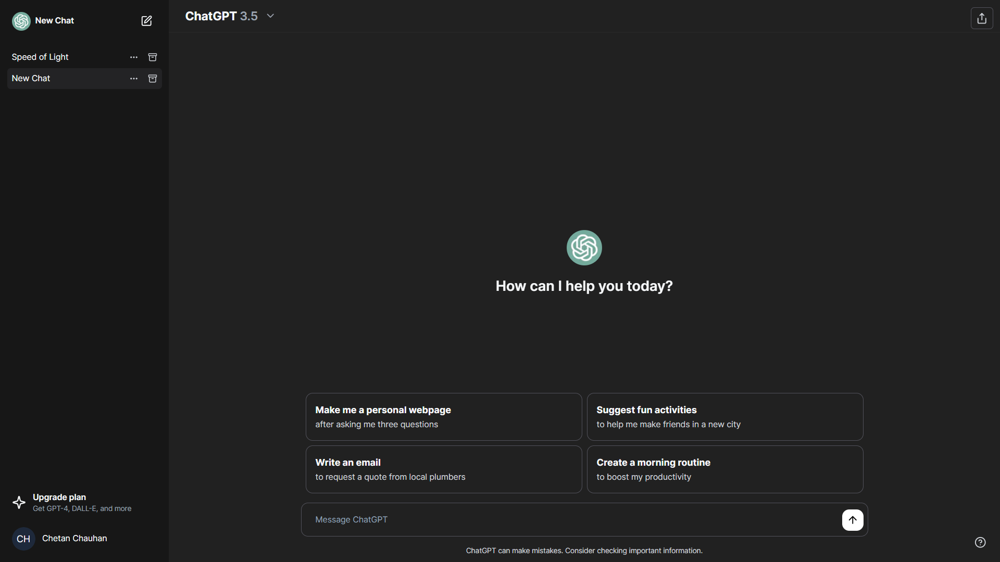

<!-- ABOUT THE PROJECT -->
# ChatGPT clone


This project is a ChatGPT clone website, designed to engage users in conversation.
Users can efficiently manage their conversations, organizing and accessing past chats with ease.

Use the `README.md` to get started.

<!-- BUILT WITH -->
# Built With

The Tech Stacks used are:

<div align="center">
  <a href="https://skillicons.dev">
      
  </a>
</div>

## Installation

1. Clone the repository to your local machine:

   ```bash
   git clone https://github.com/Chetan3327/ChatGPT.git
   ```
2. Navigate to the directory:

   ```bash
   cd ChatGPT
   ```
3. Install dependencies:

   ```bash
   npm install
   ```
4. run the development server:

   ```bash
   npm run dev
   ```

<!-- CONTACT -->
# Contact

<ul>
   <li>Name: Chetan Chauhan</li>
   <li>Mail: chauhanchetan12789@gmail.com</li>
   <li>Linkedin: https://www.linkedin.com/in/chetan-chauhan-860106258/</li>
   <li>Project Link: https://chatgpt3327.vercel.app/</li>
</ul>
